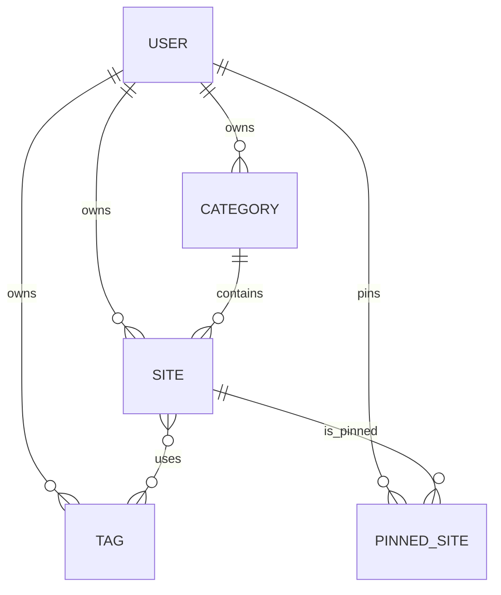

# 后端架构

## 1. 技术选型与入口

后端是 FastAPI + SQLAlchemy 2 + SQLite，使用 Pydantic Settings 配置，JWT（`python-jose`）认证，bcrypt 密码哈希。入口为 `backend/app/main.py`；`backend/run.py` 与 `backend/run.sh` 用于启动服务，默认监听 `0.0.0.0:9966`。

路由采用 thin router 模式：认证、查询和置顶业务逻辑直接位于 `app/routers/`，当前没有独立 service 层。

## 2. 目录

```text
backend/
├── run.py
├── run.sh
├── alembic.ini
├── alembic/env.py
├── alembic/versions/0001_initial.py
└── app/
    ├── main.py
    ├── config.py
    ├── database.py
    ├── security.py
    ├── seed.py
    ├── models/entities.py
    └── routers/{auth,nav,pins}.py
```

`main.py` 启动时执行 `Base.metadata.create_all(engine)`；迁移目录同时保留 Alembic 初始迁移，因此当前是 `create_all` 与 Alembic 并存的双轨方案。

## 3. 数据模型



| 表 | 关键字段与约束 |
|---|---|
| `users` | `username` 唯一、`password_hash`、`created_at` |
| `categories` | `user_id`、`slug`、`name`、`sort_order`；用户内 `slug` 唯一 |
| `tags` | `user_id`、`name`；用户内 `name` 唯一 |
| `sites` | `user_id`、可空 `category_id`、`slug`、`name`、`url`、`desc`、`detail`、`default_pinned`、`sort_order`；用户内 `slug` 唯一 |
| `site_tags` | `site_id` + `tag_id` 联合主键，多对多关联 |
| `user_pinned_sites` | `user_id` + `site_id` 联合主键，用户置顶关联 |

每个业务查询都按 `user_id` 限定。`slug` 是前端使用的稳定站点/分类标识，数据库自增 `id` 不直接暴露。

## 4. 路由契约

| 方法 | 路径 | 认证 | 用途 |
|---|---|---|---|
| `GET` | `/health` | 否 | 返回 `{"status":"ok"}` |
| `POST` | `/api/auth/login` | 否 | 用户名密码登录，返回 `access_token`、`token_type`、`username` |
| `GET` | `/api/auth/me` | 是 | 返回当前用户名 |
| `GET` | `/api/auth/accounts` | 是 | 返回其他账户用户名 |
| `GET` | `/api/nav` | 是 | 返回当前用户的 categories、tags、sites |
| `GET` | `/api/pins` | 是 | 返回 `site_ids`；首次访问时导入默认置顶 |
| `PUT` | `/api/pins` | 是 | 用 slug 数组整体替换置顶集合 |
| `POST` | `/api/pins/{site_id}/toggle` | 是 | 切换一个站点的置顶状态 |

`/api/nav` 的站点响应字段为 `id`、`name`、`url`、`desc`、`detail`、`category`、`tags`、`pinned`。认证依赖位于 `routers/auth.py` 的 `current_user`，所有受保护路由复用它。

## 5. 认证与安全

登录成功后签发 Bearer JWT，token subject 为用户名，过期时间由 `jwt_expire_minutes` 控制。`OAuth2PasswordBearer` 从 `Authorization` 头读取 token，`decode_username()` 校验后查询用户。密码使用 bcrypt 哈希；无效凭证返回 401。前端保存 token 于 `nav_token`，不是后端 session。

## 6. 配置

`app/config.py` 从 `.env` 读取以下变量，环境变量名为字段名的大写形式：

| 变量 | 默认值 | 作用 |
|---|---|---|
| `DATABASE_URL` | `sqlite:///./nav_station.db` | SQLAlchemy 数据库 URL |
| `JWT_SECRET` | `change-this-secret-in-production` | JWT 签名密钥，生产必须覆盖 |
| `JWT_EXPIRE_MINUTES` | `10080` | token 有效期 |
| `CORS_ORIGINS` | 生产域名与本地开发地址 | 逗号分隔的允许来源 |

## 7. Seed 与数据库初始化

运行 `python -m app.seed`（或按 `backend/README.md` 的启动流程）会创建表并从 `src/data/sites.json` 导入 `yzjiang`，从 `src/data/sites-test.json` 导入 `test`。新用户默认密码当前为 `123456`。已存在的用户名会跳过导入；分类、标签、站点顺序来自 JSON，`pinned` 写入 `default_pinned`。

seed 的根目录由 `seed.py` 从 `backend/app` 向上解析到项目根目录，因此部署时必须保留 `src/data` 路径或调整 seed 输入。
