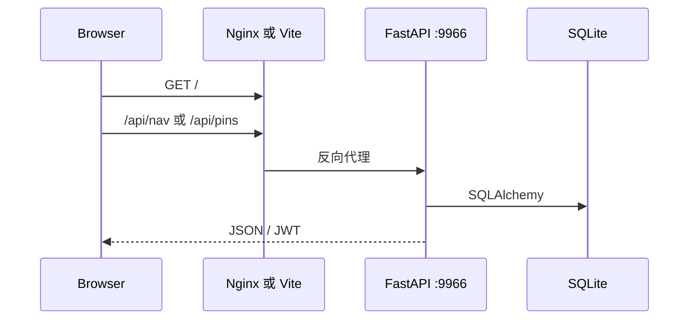

# 全栈架构概览

## 系统边界

Nav Station 是 Vue 3 SPA 与 FastAPI API 的前后端分离个人导航站。浏览器只通过同源 `/api` 访问后端；站点、分类、标签与用户置顶属于 SQLite，前端 localStorage 只保存认证缓存和主题偏好。

## 开发与生产

| 环境 | SPA | API |
|---|---|---|
| 开发 | Vite `5173` | Vite proxy `/api` → `127.0.0.1:9966` |
| 生产 | Nginx，配置见 `nginx/nav.5ai.icu.conf` | Nginx `/api` → FastAPI `9966`；systemd 单元见 `backend/nav-station-api.service` |

后端入口是 `backend/app/main.py`，服务默认监听 `0.0.0.0:9966`。前端构建产物由 Nginx 提供，FastAPI 不负责 SPA 静态文件。

## 认证流

1. 登录视图向 `POST /api/auth/login` 发送用户名和密码。
2. API 返回 Bearer JWT；前端写入 `nav_token`，用户名缓存到 `nav_user`。
3. `src/api/client.js` 为每个请求附加 `Authorization: Bearer <token>`。
4. API 通过 `current_user` 解码 JWT 并按用户查询数据。
5. 401 会清理前端认证缓存并回到登录状态。

## API 总览

| 方法 | 路径 | 数据归属 | 说明 |
|---|---|---|---|
| `GET` | `/health` | 全局 | 健康检查 |
| `POST` | `/api/auth/login` | 登录用户 | 签发 JWT |
| `GET` | `/api/auth/me` | 当前用户 | 验证 token |
| `GET` | `/api/auth/accounts` | 当前用户 | 账户切换列表 |
| `GET` | `/api/nav` | 当前用户 | 完整导航数据 |
| `GET` | `/api/pins` | 当前用户 | 置顶 slug 列表 |
| `PUT` | `/api/pins` | 当前用户 | 替换置顶集合 |
| `POST` | `/api/pins/{site_id}/toggle` | 当前用户 | 切换站点置顶 |

详细请求响应和实现见 [frontend.md](frontend.md) 与 [backend.md](backend.md)。

## 数据归属

- SQLite：`users`、`categories`、`tags`、`sites`、`site_tags`、`user_pinned_sites`。
- `nav_token`：浏览器认证缓存，不是业务数据。
- `nav_user`：浏览器中的用户名显示缓存。
- `nav_theme`：浏览器主题偏好。
- `src/data/sites*.json`：seed 输入，不是运行时前端业务数据源。

跨栈契约变化必须同时检查 API client、对应 composable、路由实现和本页 API 表。
